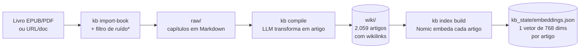
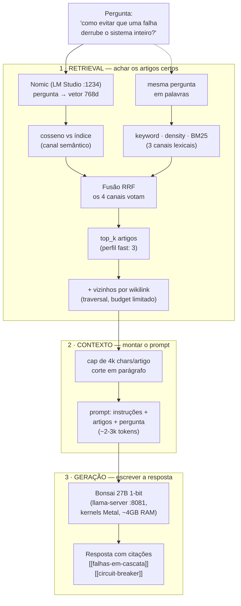

# Como funciona o KB

[TOC]

## A explicação de elevador (4 frases)

> Eu ingiro livros e documentos, e um LLM compila cada capítulo num artigo de wiki em Markdown. Todos os artigos ganham um **vetor de significado** (embedding, gerado por um modelo local). Quando faço uma pergunta, ela também vira vetor e o sistema encontra os artigos **semanticamente** mais próximos — mesmo sem palavras em comum — combinando isso com busca lexical clássica. Os melhores artigos viram contexto para um segundo modelo local (27B em 1-bit) escrever a resposta **citando as fontes** — tudo rodando no meu Mac, sem nuvem, custo zero.

## Fluxo 1 — Construção da base (offline, uma vez por fonte)

\* O filtro de ruído (feature 011) descarta prefácios, agradecimentos, colofões etc. — só conhecimento real entra na base.

## Fluxo 2 — Resposta a uma pergunta (kb qa)

## Quem faz o quê

| Peça | Papel | Onde roda |
|---|---|---|
| **Nomic v2-moe** (embedding, 768d, multilíngue) | Traduz texto → vetor de significado. Não pesquisa: fornece a representação | LM Studio `:1234` |
| **Índice** (`kb_state/embeddings.json`) | Vetores pré-computados dos 2.059 artigos + hash p/ atualização incremental | arquivo no vault |
| **kb (engine Python)** | A busca em si: cosseno, BM25, fusão RRF, perfis, cap de contexto, traversal | CLI local |
| **Bonsai 27B 1-bit** (gerador) | Lê os artigos vencedores e escreve a resposta citando fontes | llama-server `:8081` |

## Por que híbrido (semântico + lexical)?

- **Semântico acha o que o lexical perde**: "automóvel" encontra o artigo de "carro"; paráfrases funcionam.
- **Lexical acha o que o semântico perde**: termos exatos, siglas, nomes próprios (BM25 é imbatível em match literal).
- A fusão RRF pega o melhor dos dois — e se o índice/embedder cair, o sistema **degrada para só-lexical sem quebrar**.

## Números do sistema hoje

- 2.059 artigos indexados (dim 768) · rebuild incremental por hash
- QA perfil fast: **~1m15s–2m** por pergunta (era ~5min antes do context budget)
- Perfis: `fast` (3 artigos), `deep` (5, contexto maior), `paper`/`article` (reservados aos módulos de autoria)
- 100% local: zero custo por pergunta, nada sai da máquina  
