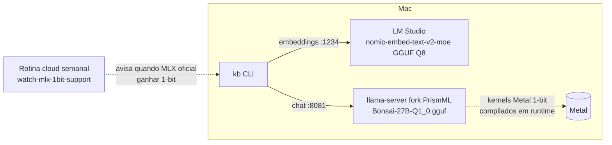

# Stack 100% local do KB — Bonsai 27B 1-bit + Nomic v2-moe

[TOC]

## Resultado

> **Pipeline 100% local, custo zero, sem Xcode.** `kb qa`/`search` rodam com retrieval híbrido (Nomic v2-moe multilíngue) + geração no Bonsai 27B 1-bit (~4GB RAM), suíte com 440 testes verdes. Ollama removido. Watch semanal criado para migrar a MLX nativo quando o upstream suportar 1-bit.

## Arquitetura final

| Camada | Serviço | Modelo | Porta |
|---|---|---|---|
| Embeddings (search/qa) | LM Studio (engine llama.cpp) | `text-embedding-nomic-embed-text-v2-moe` (GGUF Q8_0 oficial, multilíngue) | 1234 |
| Chat (qa/compile/heal) | `llama-server` fork PrismML (pin `62061f91`, release `prism-b9591`) | `bonsai-27b-1bit` (`Bonsai-27B-Q1_0.gguf`, 3.8GB) | 8081 |

Defaults do kb (`kb/config.py` / `kb/embeddings.py`): `KB_BASE_URL=http://localhost:8081/v1`, `KB_MODEL=bonsai-27b-1bit`, `KB_EMBED_BASE_URL=http://localhost:1234/v1`, `KB_EMBED_MODEL=text-embedding-nomic-embed-text-v2-moe`. Tudo sobrescritível por env.

## A saga do 1-bit (por que GGUF e não MLX)

1. `Bonsai-27B-mlx-1bit` não carrega em runtime nenhum de fábrica: MLX oficial (0.32.0) e o mlx-engine do LM Studio só suportam 2/3/4/5/6/8 bits (issue upstream #3161 aberta).
2. O 1-bit roda apenas nos forks da PrismML. O fork MLX exige build de fonte cujo compilador `metal` **só vem com o Xcode completo** — descartado pelo dono. Exaustão verificada: modo JIT ainda usa `metal` p/ kernels base; Metal Toolchain standalone não existe sem `xcodebuild`; sem wheels em PyPI; sem assets na release do fork.
3. **Plano A+B do dono**: (A) fork llama.cpp da PrismML com kernels Metal 1-bit sobre o pack GGUF — binário pré-compilado da release, mesmos pesos, mesma RAM; (B) watch semanal no upstream para migrar a MLX nativo quando possível (o MLX 1-bit de 4.8G fica guardado em `~/.lmstudio/models/prism-ml/`).

## Detalhes operacionais

- **Servidor Bonsai:** `~/dev/personal/local-ai-lab/start-bonsai-server.sh` (porta 8081 — a 8080 está ocupada por um serviço `bun` local; ctx 8192; `--reasoning-budget 0` + `--chat-template-kwargs '{"enable_thinking":false}'` porque o Bonsai é reasoning-model qwen3.5 e sem isso devolve `content` vazio). Log em `local-ai-lab/bonsai-server.log`.
- **Smoke validado:** `kb qa` fim-a-fim (retrieval do vault + geração + wikilink citado); geração direta ~80 tokens em ~5s.
- **Ollama removido:** cask `ollama-app` desinstalado; `~/.ollama` (4.8G) na Lixeira como `ollama-models-backup`.
- **Watch (B):** rotina cloud `watch-mlx-1bit-support`, segundas 09h07 BRT — https://claude.ai/code/routines/trig_01FcZK3rUtxfdUsYvCvZ4HiK
- Qualidade 1-bit: pequenas repetições ocasionais na prosa (trade-off aceito do operating point mínimo); o bench formal contra modelos da VM fica para a feature 013.

## Pendências

1. **Auto-start**: nem o LM Studio server nem o llama-server sobem no boot — hoje é manual (`lms server start` + `start-bonsai-server.sh`). Candidato a launchd.
2. Commits no repo KB (features 011, 012, defaults locais) — quando o dono pedir.
3. VM G0dwin offline — benchmark de modelos (feature 013 / `kb bench`) aguarda o dono ligar a VM.
4. Decisão sobre `summaries/` duplicando artigos no índice (concern da 012).
5. Se quiser velocidade: o drafter DSpark (speculative decoding, +1.8GB RAM) ficou de fora por economia de memória — opcional no futuro.
